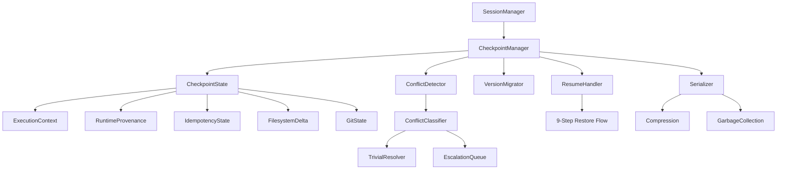
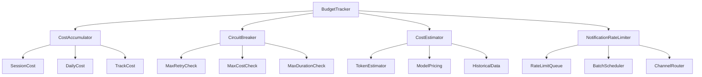
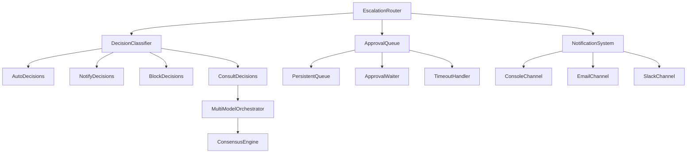

# Autonomy Epic - System Architecture

**Version**: 1.0.0
**Date**: 2026-02-22
**Status**: APPROVED
**Authority**: CTO + System Architect
**Pillar**: 3 - Software Engineering 3.0
**Stage**: 02 - DESIGN
**SDLC**: Framework 6.1.1

---

## Executive Summary

This document defines the overall system architecture for the Autonomy Epic, integrating six core subsystems: Checkpoint, Budget, Escalation, Self-Correction, Resource Routing, and Parallel Execution.

**Design Principles**:
- **Safety First**: Checkpoint/resume foundation before increasing autonomy
- **Single Process**: No multi-process complexity (async/await only)
- **Fail-Safe**: Circuit breakers, budget limits, 3-strike rules
- **Incremental**: Each sprint adds capabilities, all integrate seamlessly

---

## System Overview

### High-Level Architecture

```
┌──────────────────────────────────────────────────────────────────────────┐
│                         ENDIORBOT AUTONOMY SYSTEM                         │
│                          (Sprints 35-40)                                  │
└──────────────────────────────────────────────────────────────────────────┘

┌─────────────────────────────────────────────────────────────────────────┐
│                           LAYER 1: FOUNDATION                            │
│                        (Sprint 35-36: P0 Critical)                       │
├─────────────────────────────────────────────────────────────────────────┤
│                                                                          │
│  ┌─────────────────────────┐      ┌──────────────────────────┐          │
│  │  CHECKPOINT MANAGER     │      │  BUDGET TRACKER          │          │
│  │  (Sprint 35)            │──────│  (Sprint 36)             │          │
│  │                         │      │                          │          │
│  │  • Save execution state │      │  • Track costs           │          │
│  │  • Resume from state    │      │  • Enforce limits        │          │
│  │  • Conflict detection   │      │  • Circuit breakers      │          │
│  │  • Schema versioning    │      │  • Cost estimation       │          │
│  └─────────────────────────┘      └──────────────────────────┘          │
│              │                                 │                         │
│              └─────────────┬───────────────────┘                         │
│                            │                                             │
│  ┌─────────────────────────┴───────────────────────────────────┐        │
│  │                  ESCALATION ROUTER                           │        │
│  │                  (Sprint 36)                                 │        │
│  │                                                              │        │
│  │  • Decision classification (auto/notify/block/consult)      │        │
│  │  • Approval queue (persistent across sessions)              │        │
│  │  • Notification rate limiter (4/hour max)                   │        │
│  └──────────────────────────────────────────────────────────────┘        │
│                                                                          │
└─────────────────────────────────────────────────────────────────────────┘

┌─────────────────────────────────────────────────────────────────────────┐
│                        LAYER 2: RELIABILITY                              │
│                        (Sprint 37-38: P1 High Value)                     │
├─────────────────────────────────────────────────────────────────────────┤
│                                                                          │
│  ┌──────────────────────────┐      ┌──────────────────────────┐         │
│  │  SELF-CORRECTION ENGINE  │      │  RESOURCE ROUTER         │         │
│  │  (Sprint 37)             │──────│  (Sprint 38)             │         │
│  │                          │      │                          │         │
│  │  • Error classifier      │      │  • Task complexity       │         │
│  │  • Deterministic fixer   │      │  • Model selection       │         │
│  │  • Anti-cheat verifier   │      │  • Quality gates         │         │
│  │  • 3-strike escalation   │      │  • Ollama fallback       │         │
│  └──────────────────────────┘      └──────────────────────────┘         │
│                                                                          │
└─────────────────────────────────────────────────────────────────────────┘

┌─────────────────────────────────────────────────────────────────────────┐
│                     LAYER 3: PERFORMANCE                                 │
│                     (Sprint 39: P2 Nice-to-Have)                         │
├─────────────────────────────────────────────────────────────────────────┤
│                                                                          │
│  ┌──────────────────────────────────────────────────────────────┐       │
│  │              PARALLEL TRACK MANAGER                           │       │
│  │              (Sprint 39)                                      │       │
│  │                                                               │       │
│  │  • Track scheduler (max 2-3 concurrent)                      │       │
│  │  • File lock manager (prevent conflicts)                     │       │
│  │  • Dependency-aware scheduling                               │       │
│  │  • Per-track budget allocation                               │       │
│  └──────────────────────────────────────────────────────────────┘       │
│                                                                          │
└─────────────────────────────────────────────────────────────────────────┘

┌─────────────────────────────────────────────────────────────────────────┐
│                      LAYER 4: LEARNING                                   │
│                      (Sprint 40: P3 Future)                              │
├─────────────────────────────────────────────────────────────────────────┤
│                                                                          │
│  ┌──────────────────────────────────────────────────────────────┐       │
│  │              FIX LOGGING SYSTEM                               │       │
│  │              (Sprint 40)                                      │       │
│  │                                                               │       │
│  │  • Structured fix log (fix-log.json)                         │       │
│  │  • Weekly review CLI (pattern analysis)                      │       │
│  │  • Manual pattern import/export                              │       │
│  │  • NO adaptive ML (manual updates only)                      │       │
│  └──────────────────────────────────────────────────────────────┘       │
│                                                                          │
└─────────────────────────────────────────────────────────────────────────┘

┌─────────────────────────────────────────────────────────────────────────┐
│                     EXISTING INFRASTRUCTURE                              │
│                     (Sprint 29-34: Foundation)                           │
├─────────────────────────────────────────────────────────────────────────┤
│                                                                          │
│  • SessionManager (Sprint 34)    • Logger (Sprint 34)                   │
│  • ProviderRegistry (Sprint 29)  • Config (Sprint 33)                   │
│  • Multi-Model Orchestrator (Sprint 32)                                 │
│  • SDLC Gate Engine (Sprint 31)  • Security Layer (Sprint 30)           │
│                                                                          │
└─────────────────────────────────────────────────────────────────────────┘
```

---

## Component Diagram

### Checkpoint Manager (Sprint 35)



### Budget Tracker (Sprint 36)



### Escalation Router (Sprint 36)



---

## Data Flow Diagrams

### Checkpoint Creation Flow

```
┌────────────┐
│ User Action│ (Ctrl+C, gate pass, budget pause, manual)
└──────┬─────┘
       │
       ▼
┌────────────────────────────────────────┐
│ 1. Capture Execution State             │
│    • Session state (SessionManager)    │
│    • Task queue, current task          │
│    • Pending tool calls                │
│    • Cost tracking (BudgetTracker)     │
└──────┬─────────────────────────────────┘
       │
       ▼
┌────────────────────────────────────────┐
│ 2. Capture Runtime Provenance          │
│    • Git commit SHA                    │
│    • Working tree patch                │
│    • pnpm-lock.yaml hash               │
│    • Node.js version                   │
│    • Model config                      │
└──────┬─────────────────────────────────┘
       │
       ▼
┌────────────────────────────────────────┐
│ 3. Capture File State                  │
│    • Modified files                    │
│    • File hashes (SHA256)              │
│    • File patches (for rollback)       │
└──────┬─────────────────────────────────┘
       │
       ▼
┌────────────────────────────────────────┐
│ 4. Capture Idempotency State           │
│    • Completed actions                 │
│    • Idempotency keys                  │
│    • Tool call outputs cache           │
└──────┬─────────────────────────────────┘
       │
       ▼
┌────────────────────────────────────────┐
│ 5. Serialize Checkpoint                │
│    • schema_version: "1.0.0"           │
│    • JSON serialization                │
│    • Compression (gzip if >50KB)       │
└──────┬─────────────────────────────────┘
       │
       ▼
┌────────────────────────────────────────┐
│ 6. Persist Checkpoint                  │
│    • Path: ~/.endiorbot/projects/      │
│           {projectId}/checkpoints/     │
│           {id}.json                    │
│    • Atomic write (temp + rename)      │
└──────┬─────────────────────────────────┘
       │
       ▼
┌────────────────────────────────────────┐
│ 7. Log Event                           │
│    • EventsLogger (events.jsonl)       │
│    • Type: checkpoint                  │
│    • Reason, size, duration            │
└────────────────────────────────────────┘
```

### Resume Flow

```
┌────────────┐
│ User Resume│ (endiorbot resume [--checkpoint-id <id>])
└──────┬─────┘
       │
       ▼
┌────────────────────────────────────────┐
│ 1. Load Checkpoint                     │
│    • Default: latest checkpoint        │
│    • Or specific checkpoint by ID      │
└──────┬─────────────────────────────────┘
       │
       ▼
┌────────────────────────────────────────┐
│ 2. Version Compatibility Check         │
│    • schema_version compatible?        │
│    • If not: migrate or fail           │
└──────┬─────────────────────────────────┘
       │
       ▼
┌────────────────────────────────────────┐
│ 3. Provenance Check                    │
│    • Git commit match? (warn if diff)  │
│    • pnpm-lock match? (fail if diff)   │
│    • Node.js version match? (warn)     │
└──────┬─────────────────────────────────┘
       │
       ▼
┌────────────────────────────────────────┐
│ 4. Conflict Detection                  │
│    • Compare file hashes               │
│    • Classify conflicts:               │
│      - Trivial → auto-resolve          │
│      - Additive → new baseline         │
│      - Semantic → ask CEO              │
│      - Structural → ask CEO            │
└──────┬─────────────────────────────────┘
       │
       ▼
┌────────────────────────────────────────┐
│ 5. Idempotency Check                   │
│    • Skip completed actions            │
│    • Identify pending tool calls       │
└──────┬─────────────────────────────────┘
       │
       ▼
┌────────────────────────────────────────┐
│ 6. Restore Session State               │
│    • Session (SessionManager)          │
│    • Budget (BudgetTracker)            │
│    • Active soul (AgentScope)          │
│    • Task queue                        │
└──────┬─────────────────────────────────┘
       │
       ▼
┌────────────────────────────────────────┐
│ 7. Restore State Machine               │
│    • Gate status (SDLC gates)          │
│    • Approval queue (pending approvals)│
│    • Evidence bindings                 │
└──────┬─────────────────────────────────┘
       │
       ▼
┌────────────────────────────────────────┐
│ 8. Resume Tool Calls                   │
│    • Partial → resume from output      │
│    • Pending → retry from beginning    │
└──────┬─────────────────────────────────┘
       │
       ▼
┌────────────────────────────────────────┐
│ 9. Success / Continue                  │
│    • Log resume event                  │
│    • Return control to agent           │
└────────────────────────────────────────┘
```

### Budget Enforcement Flow

```
┌────────────┐
│ Task Start │
└──────┬─────┘
       │
       ▼
┌────────────────────────────────────────┐
│ 1. Cost Estimation                     │
│    • Task complexity → model selection │
│    • Token estimation                  │
│    • Historical average (if available) │
│    • Confidence scoring                │
└──────┬─────────────────────────────────┘
       │
       ▼
┌────────────────────────────────────────┐
│ 2. Budget Check                        │
│    • Session budget available?         │
│    • Daily budget available?           │
│    • Track budget available? (Sprint 39)│
└──────┬─────────────────────────────────┘
       │
   ┌───┴───┐
   │  YES  │  NO
   ▼       ▼
┌──────┐  ┌────────────────────┐
│Execute│  │ Pause + Notify CEO │
│ Task  │  │ • Checkpoint       │
└───┬──┘  │ • Approval request │
    │     └────────────────────┘
    ▼
┌────────────────────────────────────────┐
│ 3. Track Cost During Execution         │
│    • Provider reports token usage      │
│    • BudgetTracker accumulates cost    │
│    • Update CheckpointState            │
└──────┬─────────────────────────────────┘
       │
       ▼
┌────────────────────────────────────────┐
│ 4. Post-Execution Budget Check         │
│    • Session cost >= limit? → Pause    │
│    • Daily cost >= limit? → Pause      │
│    • Session cost >= 80%? → Warn       │
└──────┬─────────────────────────────────┘
       │
       ▼
┌────────────────────────────────────────┐
│ 5. Circuit Breaker Check               │
│    • Retry count > 3? → Escalate       │
│    • Task cost > $0.50? → Escalate     │
│    • Task duration > 5 min? → Escalate │
└────────────────────────────────────────┘
```

---

## State Machine Diagrams

### Self-Correction State Machine (Sprint 37)

```
┌────────────┐
│   START    │
└──────┬─────┘
       │
       ▼
┌────────────────────────────────────────┐
│        VERIFY                          │
│  (build + lint + typecheck + test)    │
└──────┬─────────────────────────────────┘
       │
   ┌───┴───┐
   │ PASS  │  FAIL
   ▼       ▼
┌──────┐  ┌────────────────────┐
│SUCCESS│  │  CLASSIFY ERROR    │
└──────┘  └─────────┬──────────┘
                    │
        ┌───────────┼───────────┐
        │           │           │
        ▼           ▼           ▼
  ┌─────────┐ ┌─────────┐ ┌─────────┐
  │  BUILD  │ │  LINT   │ │  TYPE   │ │ TEST │ │ LOGIC │
  │  ERROR  │ │  ERROR  │ │  ERROR  │ │ERROR │ │ERROR  │
  └────┬────┘ └────┬────┘ └────┬────┘ └───┬──┘ └───┬───┘
       │           │           │          │        │
       └───────────┴───────────┴──────────┘        │
                   │                               │
                   ▼                               ▼
          ┌──────────────────┐           ┌─────────────┐
          │ DETERMINISTIC FIX│           │  ESCALATE   │
          │ (70-90% success) │           │   TO CEO    │
          └────────┬─────────┘           └─────────────┘
                   │
                   ▼
          ┌──────────────────┐
          │ ANTI-CHEAT CHECK │
          │ (reject if rules │
          │  disabled)       │
          └────────┬─────────┘
                   │
               ┌───┴───┐
               │ PASS  │  FAIL
               ▼       ▼
          ┌──────┐  ┌──────────┐
          │ APPLY│  │ ESCALATE │
          │  FIX │  │          │
          └───┬──┘  └──────────┘
              │
              ▼
          ┌──────────────────┐
          │ INCREMENT STRIKE │
          │ (1, 2, or 3)     │
          └────────┬─────────┘
                   │
               ┌───┴───┐
               │ < 3   │  >= 3
               ▼       ▼
          ┌──────┐  ┌──────────┐
          │VERIFY│  │ ESCALATE │
          │AGAIN │  │ (3 strikes)│
          └──────┘  └──────────┘
```

### Resource Routing State Machine (Sprint 38)

```
┌────────────┐
│ TASK START │
└──────┬─────┘
       │
       ▼
┌────────────────────────────────────────┐
│     CLASSIFY TASK COMPLEXITY            │
│ • Code size, dependencies, logic depth │
│ • Risk level, reasoning required       │
└──────┬─────────────────────────────────┘
       │
   ┌───┴────────┬────────────┬──────────┐
   │            │            │          │
   ▼            ▼            ▼          ▼
┌──────┐  ┌─────────┐  ┌─────────┐ ┌─────────┐
│SIMPLE│  │MODERATE │  │ COMPLEX │ │CRITICAL │
│(0-30)│  │(31-60)  │  │(61-85)  │ │(86-100) │
└───┬──┘  └────┬────┘  └────┬────┘ └────┬────┘
    │          │             │           │
    ▼          ▼             ▼           ▼
┌──────┐  ┌─────────┐  ┌─────────┐ ┌─────────┐
│OLLAMA│  │  HAIKU  │  │ SONNET  │ │  OPUS   │
│ FREE │  │ $0.05   │  │ $0.50   │ │ $2.00   │
└───┬──┘  └────┬────┘  └────┬────┘ └────┬────┘
    │          │             │           │
    └──────────┴─────────────┴───────────┘
                     │
                     ▼
          ┌────────────────────┐
          │  QUALITY GATE CHECK│
          │ (critical tasks    │
          │  require Opus min) │
          └──────────┬─────────┘
                     │
                 ┌───┴───┐
                 │ PASS  │  FAIL
                 ▼       ▼
            ┌────────┐  ┌──────────┐
            │EXECUTE │  │ UPGRADE  │
            │  TASK  │  │  MODEL   │
            └────────┘  └──────────┘
```

---

## Integration Points

### Existing Modules (Sprint 29-34)

| Module | Purpose | Integration with Autonomy |
|--------|---------|---------------------------|
| **SessionManager** (Sprint 34) | Manage session lifecycle | Checkpoint hooks, resume session |
| **SessionStore** (Sprint 34) | Persist session state | Checkpoint storage backend |
| **TokenCounter** (Sprint 34) | Count tokens per request | Budget cost tracking |
| **Logger** (Sprint 34) | Application logging | Event logging foundation |
| **ProviderRegistry** (Sprint 29) | Manage AI providers | Cost reporting hooks |
| **BaseProvider** (Sprint 29) | Provider interface | Token usage + cost data |
| **Multi-Model Orchestrator** (Sprint 32) | Consensus queries | Escalation consultation |
| **SDLC Gate Engine** (Sprint 31) | Gate evaluation | Checkpoint on gate pass |
| **Security Layer** (Sprint 30) | Input/output sanitization | Anti-cheat verifier |

### New Modules (Sprint 35-40)

| Module | Purpose | Dependencies |
|--------|---------|--------------|
| **CheckpointManager** (35) | Save/restore state | SessionManager, Logger |
| **BudgetTracker** (36) | Track costs, enforce limits | CheckpointManager, ProviderRegistry |
| **EscalationRouter** (36) | Classify + route decisions | Multi-Model Orchestrator, Notification |
| **SelfCorrectionEngine** (37) | Auto-fix errors | BudgetTracker, EscalationRouter |
| **ResourceRouter** (38) | Select model by complexity | BudgetTracker, ProviderRegistry |
| **TrackManager** (39) | Parallel execution | CheckpointManager, BudgetTracker |
| **FixLogger** (40) | Log fixes for analysis | SelfCorrectionEngine, Logger |

---

## Cross-Module Communication

### Message Flow: Task Execution

```
1. CEO: endiorbot start myproject --task "Implement user login"

2. SessionManager: createSession()
   ├─> CheckpointManager: createInitialCheckpoint()
   ├─> BudgetTracker: initializeBudget(session)
   └─> AgentScope: setActiveSoul('implementer')

3. Agent: analyzeTask("Implement user login")
   ├─> ResourceRouter: classifyComplexity(task)
   │   └─> TaskClassifier: analyze() → "moderate" (score: 45)
   │   └─> ResourceRouter: selectModel("moderate") → "claude-haiku"
   │
   ├─> BudgetTracker: estimateCost(task, "claude-haiku")
   │   └─> CostEstimator: estimate() → $0.15 (confidence: medium)
   │
   ├─> BudgetTracker: checkBudget($0.15)
   │   └─> BudgetAction: { action: 'continue', remaining: { session: $1.85 } }
   │
   └─> Agent: executeTask(task, "claude-haiku")

4. Agent: generateCode()
   ├─> Provider: sendRequest(prompt, "claude-haiku")
   │   └─> Anthropic API: ...
   │
   ├─> Provider: receiveResponse(output, tokenUsage)
   │   └─> BudgetTracker: recordCost($0.12, tokens: { input: 500, output: 800 })
   │
   └─> Agent: applyChanges(code)

5. SelfCorrectionEngine: verify()
   ├─> Verifier: runBuild() → FAIL (TS2304: Cannot find name 'User')
   ├─> ErrorClassifier: classify(error) → "type" (fixable: true, confidence: high)
   ├─> DeterministicFixer: fixMissingImport('User')
   │   └─> findSymbolDefinition('User') → "src/models/user.ts"
   │   └─> addImport(file, 'User', './models/user.ts')
   │
   ├─> AntiCheatVerifier: verify(patch) → PASS (no rule violations)
   ├─> Agent: applyFix(patch)
   └─> Verifier: runBuild() → PASS

6. CheckpointManager: autoCheckpoint("task_complete")
   └─> CheckpointState: { sessionCostSoFar: $0.12, ... }

7. SessionManager: completeTask(task)
   └─> Agent: returnOutput(result)
```

### Message Flow: Budget Limit Reached

```
1. BudgetTracker: recordCost($0.50)
   └─> sessionCost: $2.00 (>= $2.00 limit)

2. BudgetTracker: handleLimitReached('session', $2.00)
   ├─> CheckpointManager: create({ reason: 'budget_pause' })
   │   └─> CheckpointState: saved to disk
   │
   ├─> NotificationRateLimiter: send({
   │       type: 'budget_limit',
   │       message: 'Session budget limit reached: $2.00',
   │       options: ['continue_with_approval', 'switch_to_ollama', 'stop']
   │   })
   │
   └─> BudgetAction: { action: 'pause', reason: 'session_limit_reached' }

3. Agent: pauseExecution()
   └─> SessionManager: pauseSession()

4. CEO: endiorbot approve <approval-id> --action switch_to_ollama

5. ApprovalQueue: processApproval(approvalId, 'switch_to_ollama')
   ├─> ResourceRouter: switchModel('ollama/qwen2.5-coder')
   ├─> BudgetTracker: resetSessionBudget() (Ollama is free)
   └─> Agent: resumeExecution(model: 'ollama')
```

---

## Non-Functional Requirements

### Performance

| Metric | Target | Measurement |
|--------|--------|-------------|
| **Checkpoint creation** | <2 sec | Time from trigger to disk write |
| **Resume time** | <5 sec | Time from load to execution |
| **Conflict detection** | <1 sec | Time to check all file hashes |
| **Budget check** | <100 ms | Time to validate limits |
| **Cost estimation** | <500 ms | Time to predict task cost |
| **Error classification** | <200 ms | Time to categorize error |
| **Deterministic fix** | <3 sec | Time to apply fix pattern |

### Reliability

| Metric | Target | Measurement |
|--------|--------|-------------|
| **Resume success rate** | >95% | Successful resumes / total attempts |
| **Budget enforcement** | 100% | Hard limit never exceeded |
| **Auto-fix success rate** | 70-90% | Fixes that pass verification |
| **Conflict resolution** | >80% | Auto-resolved / total conflicts |
| **Notification delivery** | >99% | Notifications sent / total triggers |

### Scalability

| Metric | Target | Notes |
|--------|--------|-------|
| **Checkpoint size** | <100 KB | Compressed, garbage collection |
| **Max checkpoints** | 10 per project | Oldest deleted automatically |
| **Max parallel tracks** | 3 | Single process constraint |
| **Max approval queue** | 20 pending | Escalate if exceeded |
| **Fix log size** | <10 MB | Rotation when exceeded |

### Security

| Metric | Target | Measurement |
|--------|--------|-------------|
| **Anti-cheat detection** | >95% | Rule violations blocked |
| **Secrets in checkpoints** | 0% | Sanitization complete |
| **File lock bypass** | 0% | Concurrent edits prevented |

---

## Deployment Architecture

### File System Layout

```
~/.endiorbot/
├── config.json                    # User configuration
├── projects/
│   ├── {projectId}/
│   │   ├── checkpoints/
│   │   │   ├── ckpt-20260322-100000.json
│   │   │   ├── ckpt-20260322-110000.json
│   │   │   └── ...
│   │   ├── sessions/
│   │   │   └── session-{id}.json
│   │   ├── context.json           # Project context (ADR-002)
│   │   └── fix-log.json           # Fix logging (Sprint 40)
│   └── ...
├── approvals.json                 # Approval queue (persistent)
├── events.jsonl                   # Event log (append-only)
├── budget-state.json              # Budget tracking state
└── backups/
    ├── daily/
    └── weekly/
```

### Process Model

**Single Process Architecture**:
```
Node.js Process (endiorbot)
├─ Main Thread (event loop)
│  ├─ SessionManager
│  ├─ CheckpointManager
│  ├─ BudgetTracker
│  ├─ EscalationRouter
│  ├─ SelfCorrectionEngine
│  ├─ ResourceRouter
│  └─ TrackManager (manages 2-3 async tracks)
│
└─ Async/Await Concurrency
   ├─ Track 1: Implementation (async)
   ├─ Track 2: Testing (async)
   └─ Track 3: Documentation (async)
```

**No Multi-Process**:
- ❌ No worker threads
- ❌ No child processes
- ❌ No clustering
- ✅ Single process, async/await only

---

## Related Documents

- **Problem Statement**: `00-problem-statement.md`
- **Business Case**: `01-business-case.md`
- **Detailed Design**: Sprint-specific design docs (01-06)
- **Integration Specs**: `docs/03-integrate/autonomy-epic/`
- **ADRs**: ADR-006 through ADR-011

---

**Approved By**: CTO + System Architect
**Date**: 2026-02-22
**Status**: APPROVED - Architecture foundation
**Next Review**: Sprint 35 Day 1 (Checkpoint implementation kickoff)

---

*Autonomy Epic - System Architecture v1.0.0*
*EndiorBot SDLC Framework 6.1.1*
